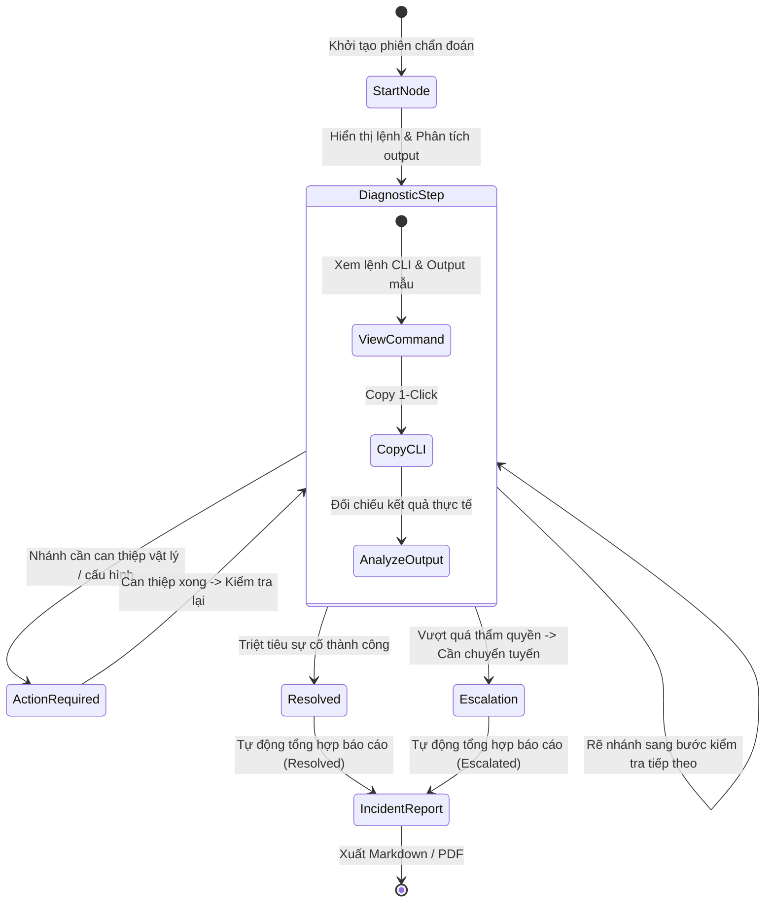
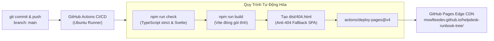

# 🏛️ Kiến Trúc Hệ Thống: IT Support Diagnostic Decision Tree & Interactive Runbooks

- **GitHub Repository**: `https://github.com/mowfteedev/helpdesk-runbook-tree`
- **Địa chỉ Xuất bản Live (GitHub Pages)**: `https://mowfteedev.github.io/helpdesk-runbook-tree/`
- **Tagline**: *Interactive L1-L3 troubleshooting tree and incident report generator*
- **Kiến trúc sư**: `@tech-lead` (mowftee-guild)
- **Mô hình Vận hành**: **Zero-Server / Zero-Ops (GitHub Pages Global Edge CDN)**

---

## 1. Tổng Quan & Tầm Nhìn Kỹ Thuật

`helpdesk-runbook-tree` là công cụ chẩn đoán sự cố mạng, dịch vụ và hệ điều hành theo cây quyết định đồ thị có hướng không chu trình (DAG) từ tầng vật lý L1 đến ứng dụng L7.

### Mục Tiêu Cốt Lõi:
1. **Chuẩn hóa quy trình chẩn đoán (Guided Troubleshooting)**: Giúp kỹ thuật viên Helpdesk L1 và Network Admin chẩn đoán tuần tự có phương pháp từ dưới lên (Bottom-Up), giảm 60% thời gian trung bình xử lý sự cố (MTTR).
2. **Loại bỏ sự phụ thuộc vào máy chủ (Zero-Server Architecture)**: Chạy 100% trên trình duyệt người dùng, lưu trữ Local-First qua `localStorage`, hoàn toàn không cần backend server. Khi mạng nội bộ sập, ứng dụng vẫn hoạt động 100%.
3. **Chi phí vận hành bằng 0 VNĐ**: Triển khai hoàn toàn trên GitHub Pages, tự động hóa cập nhật qua GitHub Actions, không phát sinh chi phí duy trì hàng tháng.
4. **Chuẩn hóa biên bản sự cố (ITIL-Ready Incident Reports)**: Tự động ghi lại toàn bộ hành trình chẩn đoán (Audit Trail) và xuất ra file Markdown (cho Jira/ServiceNow) hoặc PDF chỉ bằng 1 cú click.

---

## 2. Công Nghệ Lựa Chọn (Tech Stack) & Ma Trận Đánh Đổi

| Thành phần | Công nghệ lựa chọn | Lý do & Đánh đổi kỹ thuật |
| :--- | :--- | :--- |
| **Framework UI** | **Svelte 5 + Vite (TypeScript)** | **Ưu điểm**: Zero-virtual-DOM, reactive runes (`$state`, `$derived`, `$props`), bundle siêu nhẹ (~26KB gzip), TypeScript type-safe tuyệt đối cho Schema dữ liệu cây. <br>**Đánh đổi**: Cần bước build Vite (so với HTML thuần), nhưng đổi lại mã nguồn module hóa cực sạch và phát hiện lỗi kiểu ngay từ lúc code. |
| **Styling** | **Tailwind CSS v4 + Lucide Icons** | Giao diện chuẩn IT Ops / Terminal / Dark Mode hiện đại, trực quan, hỗ trợ Mobile/Desktop responsive, kích thước CSS tối ưu. |
| **Hạ tầng Vận hành** | **GitHub Pages (Fastly CDN Edge)** | **Zero-Ops**: Xuất bản tự động qua GitHub Actions (`deploy-pages@v4`), miễn phí 100%, uptime 99.9%, tự động cấp phát chứng chỉ SSL/TLS. |
| **Lưu trữ dữ liệu** | **Local-First (`localStorage` + JSON Import/Export)** | Lưu vết toàn bộ lịch sử chẩn đoán, audit trail ngay trong trình duyệt máy kỹ thuật viên; mất mạng hoặc reload tab vẫn giữ nguyên phiên. |
| **Dữ liệu Runbook** | **Static Bundled Hash Map (`Record<string, RunbookNode>`)** | Toàn bộ cây chẩn đoán là cấu trúc dữ liệu thuần túy (Node Graph) tách biệt khỏi code giao diện, truy xuất $O(1)$ tức thì, loại bỏ hoàn toàn chi phí query. |
| **Báo cáo sự cố** | **Client-Side Exporter (Markdown + Native Print / jsPDF)** | Tự động sinh báo cáo chuẩn ITIL ngay trên trình duyệt mà không cần gọi API chuyển đổi PDF từ server bên ngoài. |

---

## 3. Ranh Giới Nghiệp Vụ & Cấu Trúc Module Chuẩn

Hệ thống tuân thủ nguyên tắc **Clean Architecture** với chiều phụ thuộc hướng vào trong (Dependency Rule):
`Giao diện (Components) -> Lõi Điều Hướng (Engine) -> Dữ liệu (Data) -> Hợp đồng Kiểu (Types)`.

```text
helpdesk-runbook-tree/
├── .github/
│   └── workflows/
│       └── deploy.yml            # CI/CD tự động hóa đóng gói và deploy GitHub Pages
├── .memory/                      # Bộ nhớ dự án của mowftee-guild
│   ├── adr/                      # Các biên bản quyết định kiến trúc
│   │   ├── 0001-khoi-tao-du-an.md
│   │   └── 0002-kien-truc-van-hanh-github-pages-zero-ops.md
│   ├── architecture.md           # Nguồn chân lý kiến trúc kỹ thuật
│   └── progress.md               # Bảng tiến độ và phân công tác chiến
├── docs/                         # Cẩm nang kỹ thuật & bàn giao
│   ├── HOW_TO_ADD_RUNBOOK.md     # Cẩm nang mở rộng kịch bản Runbook mới
│   └── DEPLOYMENT_GUIDE.md       # Hướng dẫn kích hoạt & cấu hình GitHub Pages
├── src/
│   ├── types/                    # Tầng Hợp đồng Dữ liệu (Data Contracts)
│   │   ├── runbook.ts            # Định nghĩa Runbook, Node, Command, Session, Report
│   │   └── index.ts              # Re-export module
│   ├── data/                     # Tầng Dữ liệu Kịch bản (Runbook Datasets)
│   │   ├── network-runbook.ts    # Kịch bản chẩn đoán Network L1-L3 (22 nodes)
│   │   └── index.ts              # Registry tập trung các bộ kịch bản
│   ├── engine/                   # Lõi Thuật Toán & Xử Lý Trạng Thái (Core Engine)
│   │   ├── validator.ts          # Thuật toán DFS kiểm định chu trình & node mồ côi
│   │   ├── traversal.ts          # Lõi điều hướng xác định, Backtrack, BFS shortest path
│   │   ├── session-store.ts      # Quản lý phiên Local-First & LocalStorage
│   │   ├── report-generator.ts   # Bộ sinh báo cáo Markdown & PDF
│   │   └── index.ts
│   ├── components/               # Tầng Giao diện Người dùng (Svelte 5)
│   │   ├── layout/               # Header, Sidebar, Breadcrumbs
│   │   ├── runbook/              # NodeViewer, TerminalCard, DecisionButtons
│   │   └── report/               # ReportModal, MarkdownPreview, ExportOptions
│   ├── styles/                   # Terminal Themes & Visual Badges
│   ├── App.svelte                # Root Component điều phối luồng ứng dụng
│   ├── app.css                   # Tailwind v4 theme & Global Styles
│   └── main.ts                   # Điểm khởi động ứng dụng Svelte 5
├── public/                       # Tài nguyên tĩnh, favicon, icons
├── package.json
├── vite.config.ts                # Cấu hình Vite (base: './' cho GitHub Pages)
└── tsconfig.json                 # Cấu hình TypeScript Strict Mode
```

---

## 4. Đặc Tả Dữ Liệu Cây Chẩn Đoán (DAG Schema Contract)

Một Node trong cây tuân thủ hợp đồng dữ liệu chuẩn tại [`src/types/runbook.ts`](../src/types/runbook.ts):

```typescript
export type OSILayer = 'L1' | 'L2' | 'L3' | 'L4' | 'L7';
export type NodeKind = 'diagnostic_step' | 'action_required' | 'resolved' | 'escalation';
export type TargetOS = 'windows' | 'linux' | 'macos' | 'all';
export type IncidentPriority = 'P1 - Critical' | 'P2 - High' | 'P3 - Medium' | 'P4 - Low';

export interface CommandSnippet {
  cli: string;                    // Câu lệnh mẫu: ping 192.168.1.1 -n 4
  os: TargetOS;                   // Hệ điều hành áp dụng
  description: string;            // Mục đích kiểm tra của lệnh
  sampleOutput: string;           // Output mẫu thực tế khi chạy
  outputAnalysisGuide: string;    // Hướng dẫn đọc kết quả output để chọn nhánh
  requiresElevation?: boolean;    // Cần quyền Administrator / sudo không
  timeoutSeconds?: number;
}

export interface DecisionBranch {
  id?: string;
  label: string;                  // Nhãn nút: "Reply từ Gateway < 2ms, 0% loss"
  description?: string;           // Giải thích bổ sung
  nextNodeId: string;             // ID node đích tiếp theo trong đồ thị
  badgeVariant?: 'success' | 'danger' | 'warning' | 'neutral' | 'info';
  isExpectedOutcome?: boolean;    // Nhánh kết quả bình thường/kỳ vọng
}

export interface RunbookNode {
  id: string;                     // Khóa chính (vd: "net-gw-ping")
  kind: NodeKind;
  title: string;
  osiLayer?: OSILayer;
  description: string;
  technicalContext?: string;      // Bối cảnh chuyên sâu giải thích tại sao làm bước này
  command?: CommandSnippet;       // Câu lệnh kiểm tra chính
  alternativeCommands?: CommandSnippet[]; // Câu lệnh trên OS khác
  branches: DecisionBranch[];     // Danh sách các nhánh rẽ điều hướng
  escalationDetails?: EscalationDetails; // Bắt buộc nếu kind === 'escalation'
  resolutionDetails?: ResolutionDetails; // Bắt buộc nếu kind === 'resolved'
  resolutionSummary?: string;
}

export interface Runbook {
  id: string;
  title: string;
  description: string;
  category: 'network' | 'windows' | 'linux' | 'database' | 'security';
  version: string;
  estimatedMinutes: number;
  targetAudience: string;
  startNodeId: string;
  nodes: Record<string, RunbookNode>; // Hash Map: O(1) Lookup
  tags: string[];
  updatedAt: string;
}
```

---

## 5. Lõi Thuật Toán Điều Hướng & Kiểm Định (Engine Architecture)



### Nguyên Tắc Hoạt Động Cốt Lõi:
1. **DAG Validation (Kiểm định toàn vẹn đồ thị)**:
   - Trước khi nạp bất kỳ Runbook nào, `validateRunbook()` sử dụng thuật toán **DFS 3-Coloring** để chứng minh không có chu trình (Cycles), thuật toán **BFS Reachability** để chứng minh không có node mồ côi (Orphans) và kiểm tra tính đóng của các nút kết thúc.
2. **Audit Trail Immutability (Lưu vết bất biến)**:
   - Mỗi bước rẽ nhánh được ghi nhận thành một bản ghi `SessionStepRecord` với timestamp ISO 8601, câu lệnh đã copy và nhánh đã chọn.
3. **Quay lui không phá hủy (Non-destructive Backtracking)**:
   - Phương thức `backtrack()` và `jumpToStep(stepIndex)` cho phép kỹ thuật viên đổi ý hoặc kiểm tra lại nhánh khác mà không làm mất tính toàn vẹn của phiên.

---

## 6. Kiến Trúc Vận Hành Zero-Ops Trên GitHub Pages



### Biện Pháp Kỹ Thuật Đảm Bảo 100% Ổn Định:
- **Relative Base Path**: Thiết lập `base: './'` trong `vite.config.ts` để mọi assets (JS/CSS/Fonts) sử dụng đường dẫn tương đối, bảo đảm hoạt động đúng trên subpath repository `/helpdesk-runbook-tree/`.
- **404 SPA Fallback**: Tự động copy `dist/index.html` thành `dist/404.html` để người dùng reload trang ở bất kỳ đường dẫn nào đều không bị trang 404 mặc định của GitHub.
- **Local-First Storage**: Dữ liệu lưu trong `localStorage` với key `helpdesk_session_active` và `helpdesk_session_history`.

---

## 7. Quy Chuẩn Kỹ Thuật Bắt Buộc (Guild Standards)

1. **Zero-Server Guarantee**: Tuyệt đối không thêm bất kỳ dependency nào đòi hỏi kết nối API backend từ xa để chạy tính năng cốt lõi. Mất mạng vẫn hoạt động 100%.
2. **Strict Type Safety**: Không sử dụng kiểu `any` trong toàn bộ codebase. 100% interfaces phải được định nghĩa rõ ràng trong `src/types/`.
3. **Copy-to-Clipboard**: 100% câu lệnh chẩn đoán phải có nút 1-click copy kèm visual feedback (đổi icon check xanh trong 2 giây).
4. **Performance SLA**:
   - Bundle size tải về: **< 35 kB gzip**.
   - Thời gian khởi động ứng dụng: **< 100ms**.
   - Thời gian chuyển bước giữa các Node: **< 16ms** (60fps, $O(1)$ memory lookup).
5. **Tiêu chuẩn Báo cáo ITIL**: Báo cáo xuất ra phải có cấu trúc chuẩn mực: Tên sự cố, Mức độ ưu tiên (P1-P4), Kỹ thuật viên, Thời gian bắt đầu/kết thúc, Lịch sử các bước kiểm tra thực tế, và Đội ngũ tiếp nhận / Hành động khắc phục.
