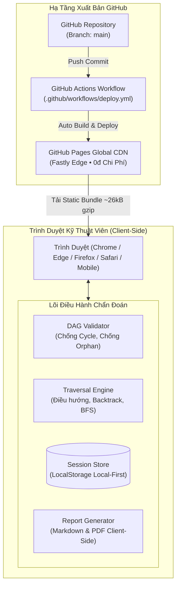

# 🌲 Helpdesk Runbook Tree

> **Interactive L1-L3 Troubleshooting Decision Tree & Incident Report Generator**  
> *Hệ thống cây quyết định tương tác hỗ trợ kỹ thuật viên Helpdesk và Network Admin khoanh vùng, xử lý sự cố mạng & hệ thống theo mô hình chuẩn OSI từ L1 đến L7, tự động xuất Biên bản sự cố chuẩn ITIL.*

---

[](https://opensource.org/licenses/MIT)
[](https://svelte.dev/)
[](#-kiến-trúc-hệ-thống--nguyên-tắc-vận-hành)
[](#-tại-sao-lại-là-zero-server--offline-first)
[](https://mowfteedev.github.io/helpdesk-runbook-tree/)

🌐 **Trải nghiệm trực tiếp trên GitHub Pages**: [https://mowfteedev.github.io/helpdesk-runbook-tree/](https://mowfteedev.github.io/helpdesk-runbook-tree/)

---

## 🎯 Bài Toán Nghiệp Vụ & Giá Trị Cốt Lõi

Khi xảy ra sự cố mạng (mất kết nối, chậm, không vào được web, không in được), kỹ thuật viên L1/L2 thường gặp các vấn đề:
1. **Chẩn đoán cảm tính, nhảy cóc**: Không đi theo trình tự chuẩn dẫn đến tốn thời gian và bỏ sót lỗi cơ bản ở tầng vật lý (L1) hoặc cấp phát IP (L2/L3).
2. **Không nhớ chính xác câu lệnh CLI & cách đọc output**: Các lệnh `ipconfig /all`, `ping`, `tracert`, `nslookup`, `arp -a` đòi hỏi phân tích đúng các chỉ số (TTL, APIPA 169.254, timeout, MAC incomplete).
3. **Bàn giao chuyển tuyến (Escalation) cẩu thả**: Khi chuyển ticket lên L2/L3/ISP NOC, thông tin thường thiếu hụt trầm trọng khiến cấp trên phải hỏi lại từ đầu.

**`helpdesk-runbook-tree`** giải quyết triệt để 3 vấn đề trên bằng mô hình **Cây Quyết Định Tương Tác (Guided Decision Tree)** và **Bộ Sinh Báo Cáo Tự Động**.

---

## ✨ Điểm Nổi Bật (Key Features)

- 🧭 **Cây Quyết Định Chuẩn Tầng Mạng (OSI L1 - L7)**: Điều hướng tuần tự từ kiểm tra cáp mạng, đèn cổng, cấp phát DHCP, Default Gateway, định tuyến WAN đến phân giải DNS và ứng dụng Web.
- 💻 **Tích Hợp Sẵn Câu Lệnh & Output Mẫu Thực Tế**: Mỗi bước chẩn đoán đều đi kèm câu lệnh CLI thực tế (Windows & Linux), ví dụ output thực tế và hướng dẫn phân tích từng dòng kết quả.
- 📋 **Sao Chép Lệnh 1-Click**: Nút bấm sao chép câu lệnh kèm phản hồi trực quan, tối ưu hóa thao tác của kỹ thuật viên.
- ⏪ **Lưu Vết Hành Trình & Hỗ Trợ Quay Lui (Audit Trail & Backtrack)**: Ghi lại từng bước đã đi qua, cho phép quay lại (Undo) hoặc nhảy trực tiếp về bước trước trên thanh Breadcrumb mà không làm mất dữ liệu.
- 📑 **Tự Động Sinh Biên Bản Sự Cố Chuẩn ITIL**: Xuất báo cáo sự cố sang **Markdown** (sẵn sàng dán vào Jira, ServiceNow, Redmine, Slack) và tải về file **PDF** chính thức.
- ⚡ **100% Zero-Server & Offline-First**: Toàn bộ hệ thống chạy trên trình duyệt người dùng, lưu dữ liệu phiên vào `localStorage`, vận hành bình thường ngay cả khi mạng nội bộ bị cô lập hoàn toàn.

---

## 🏛️ Kiến Trúc Hệ Thống & Nguyên Tắc Vận Hành

Hệ thống được thiết kế theo mô hình **Zero-Server SPA (Single Page Application)**, lưu trữ và triển khai hoàn toàn tự động trên **GitHub Pages CDN Edge**:



### Tại Sao Lại Là "Zero-Server" & "Offline-First"?
- **Không tốn chi phí thuê máy chủ (0 VNĐ)**: Không cần VPS, không cần cơ sở dữ liệu từ xa, không lo hết hạn subscription.
- **Tính sẵn sàng tuyệt đối**: Một công cụ hỗ trợ sửa mạng nội bộ **tuyệt đối không được phụ thuộc vào kết nối tới server từ xa**. Khi mạng sập, ứng dụng vẫn hoạt động 100% từ bộ nhớ cache của trình duyệt.

---

## 📁 Cấu Trúc Module & Bounded Contexts

```text
helpdesk-runbook-tree/
├── .github/
│   └── workflows/                # Quy trình tự động hóa CI/CD GitHub Actions
│       └── deploy.yml            # Build & Deploy tự động lên GitHub Pages
├── .memory/                      # Bộ nhớ dự án của mowftee-guild
│   ├── adr/                      # Các biên bản quyết định kiến trúc (ADR)
│   │   ├── 0001-khoi-tao-du-an.md
│   │   └── 0002-kien-truc-van-hanh-github-pages-zero-ops.md
│   ├── architecture.md           # Nguồn chân lý kiến trúc kỹ thuật
│   └── progress.md               # Bảng tiến độ và phân công tác chiến
├── docs/                         # Cẩm nang và tài liệu bàn giao
│   ├── HOW_TO_ADD_RUNBOOK.md     # Hướng dẫn tạo kịch bản chẩn đoán mới
│   └── DEPLOYMENT_GUIDE.md       # Cẩm nang kích hoạt & vận hành GitHub Pages
├── src/
│   ├── types/                    # Data Contract & TypeScript Schema
│   │   ├── runbook.ts            # Runbook, Node, Command, Session, Report interfaces
│   │   └── index.ts
│   ├── data/                     # Bộ dữ liệu kịch bản chuẩn hóa
│   │   ├── network-runbook.ts    # Kịch bản chẩn đoán Network L1-L3 (22 nodes)
│   │   └── index.ts              # Registry quản lý các Runbook
│   ├── engine/                   # Lõi thuật toán và điều hướng
│   │   ├── validator.ts          # Bộ kiểm định đồ thị DAG (DFS Cycle & Orphan detection)
│   │   ├── traversal.ts          # Stateful Traversal Engine (Next, Backtrack, BFS estimate)
│   │   ├── session-store.ts      # Quản lý phiên Local-First & LocalStorage
│   │   ├── report-generator.ts   # Sinh báo cáo Markdown & PDF
│   │   └── index.ts
│   ├── components/               # Giao diện người dùng Svelte 5
│   │   ├── layout/               # Header, Sidebar, Runbook Switcher
│   │   ├── runbook/              # NodeViewer, TerminalCard, DecisionButtons, Breadcrumb
│   │   └── report/               # ReportModal, MarkdownViewer, PDFExportButton
│   ├── styles/                   # Terminal Theme & CSS
│   ├── App.svelte                # Root Component điều phối
│   ├── app.css                   # Tailwind CSS v4 & theme variables
│   └── main.ts                   # Điểm khởi động ứng dụng
├── public/                       # Favicon và tài nguyên tĩnh
├── package.json
├── vite.config.ts                # Cấu hình Vite với base relative './'
└── tsconfig.json
```

---

## 🛠️ Công Nghệ Sử Dụng (Tech Stack)

| Tầng | Công nghệ | Phiên bản | Đặc tả vai trò |
| :--- | :--- | :--- | :--- |
| **Framework** | **Svelte 5** | `^5.57.0` | Quản lý state phản ứng tự nhiên qua Runes (`$state`, `$derived`), zero-virtual-DOM. |
| **Build Tool** | **Vite** | `^8.3.0` | Tối ưu đóng gói, Hot Module Replacement siêu tốc, hỗ trợ TypeScript natively. |
| **Ngôn ngữ** | **TypeScript** | `~6.0.0` | 100% strict type-safety, không `any`, đảm bảo hợp đồng dữ liệu đồ thị DAG. |
| **CSS & Theme** | **Tailwind CSS** | `^4.3.3` | `@tailwindcss/vite` styling Terminal Dark hiện đại, tối ưu dung lượng CSS. |
| **Icon System** | **Lucide Svelte** | `^1.45.0` | Bộ biểu tượng kỹ thuật và hạ tầng mạng sắc nét. |
| **Hosting & CI/CD** | **GitHub Pages** | Actions v4 | Xuất bản tự động trên Fastly Edge CDN, chi phí 0đ. |

---

## 🚀 Cài Đặt & Phát Triển Cục Bộ (Quick Start)

Yêu cầu môi trường: **Node.js >= 18.0.0** và **npm >= 9.0.0**

```bash
# 1. Clone mã nguồn về máy
git clone https://github.com/mowfteedev/helpdesk-runbook-tree.git
cd helpdesk-runbook-tree

# 2. Cài đặt các gói phụ thuộc
npm install

# 3. Khởi chạy máy chủ phát triển cục bộ (HMR)
npm run dev
# -> Mở trình duyệt tại http://localhost:5173/

# 4. Kiểm tra kiểu dữ liệu TypeScript & cú pháp Svelte
npm run check

# 5. Đóng gói bản phát hành Production
npm run build

# 6. Xem trước bản đóng gói tĩnh
npm run preview
```

---

## 📖 Tài Liệu Hướng Dẫn & Cẩm Nang Bàn Giao

- 🏛️ [Kiến Trúc Kỹ Thuật Chi Tiết (.memory/architecture.md)](.memory/architecture.md)
- 📌 [Bảng Tiến Độ & Phân Công Nhiệm Vụ (.memory/progress.md)](.memory/progress.md)
- 📑 [ADR-0001: Lựa chọn nền tảng Svelte 5 + Vite + TypeScript](.memory/adr/0001-khoi-tao-du-an.md)
- 📑 [ADR-0002: Kiến trúc vận hành Zero-Ops trên GitHub Pages](.memory/adr/0002-kien-truc-van-hanh-github-pages-zero-ops.md)
- 🛠️ [Cẩm Nang Thêm Kịch Bản Chẩn Đoán Mới (docs/HOW_TO_ADD_RUNBOOK.md)](docs/HOW_TO_ADD_RUNBOOK.md)
- 🌐 [Hướng Dẫn Kích Hoạt & Cấu Hình GitHub Pages (docs/DEPLOYMENT_GUIDE.md)](docs/DEPLOYMENT_GUIDE.md)

---

## 👥 Đội Ngũ Phát Triển (mowftee-guild)

Dự án được thiết kế, xây dựng và quản trị chất lượng bởi các chuyên gia trong **`mowftee-guild`**:
- `@tech-lead`: Kiến trúc sư trưởng & Quản trị Bộ nhớ dự án.
- `@database`: Chuyên gia Lược đồ dữ liệu & Bộ kịch bản chẩn đoán Network.
- `@backend`: Kiến trúc sư Lõi Engine (Traversal & DAG Validator).
- `@frontend` & `@designer`: Kiến trúc sư Giao diện người dùng Terminal IT Ops.
- `@devops`: Tự động hóa hạ tầng CI/CD GitHub Pages.
- `@code-reviewer` & `@security`: Thẩm định chất lượng mã nguồn và an toàn thông tin.
- `@tester`: Kiểm thử nghiệm thu thực chiến và kịch bản phá hoại cực hạn.
- `@doc-writer`: Biên soạn tài liệu kỹ thuật và cẩm nang bàn giao.

---

## 📄 Bản Quyền (License)

Dự án được phân phối dưới giấy phép mã nguồn mở **MIT License**. Mọi cá nhân và tổ chức đều có thể tự do sử dụng, chỉnh sửa và triển khai nội bộ.
