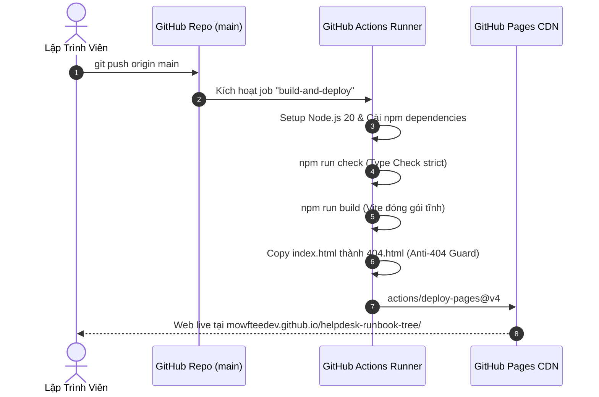

# 🚀 Hướng Dẫn Kích Hoạt & Vận Hành GitHub Pages (Zero-Ops Deployment Guide)

> **Dành cho**: Quản trị viên dự án và người vận hành hệ thống `helpdesk-runbook-tree`.

---

## 🌐 1. Địa Chỉ Truy Cập Chính Thức

Ứng dụng được xuất bản công khai và tự động tại địa chỉ:  
👉 **[https://mowfteedev.github.io/helpdesk-runbook-tree/](https://mowfteedev.github.io/helpdesk-runbook-tree/)**

- **Hạ tầng**: GitHub Pages CDN (Fastly Global Edge Network)
- **Chi phí**: **0 VNĐ** (Miễn phí 100% trọn đời)
- **Bảo mật**: Tự động cấp phát chứng chỉ HTTPS/TLS

---

## ⚙️ 2. Cách Kích Hoạt GitHub Pages Trên GitHub (Chỉ Làm 1 Lần Duy Nhất)

Để kích hoạt pipeline tự động triển khai, Bang chủ chỉ cần thao tác 3 bước đơn giản trên giao diện GitHub:

1. Truy cập vào Repository trên trình duyệt:  
   👉 `https://github.com/mowfteedev/helpdesk-runbook-tree`
2. Bấm vào tab **`Settings`** (ở thanh menu trên cùng của repo) $\rightarrow$ Tìm mục **`Pages`** ở cột menu bên trái.
3. Tại phần **`Build and deployment`**:
   - Ở mục **`Source`**, chuyển từ `Deploy from a branch` sang **`GitHub Actions`**.
4. **Xong!** Kể từ thời điểm này, mỗi khi code mới được push lên nhánh `main`, GitHub Actions sẽ tự động kích hoạt workflow, build bản đóng gói và cập nhật trang web trong vòng chưa đầy 60 giây.

---

## 🤖 3. Kiến Trúc Quy Trình CI/CD Tự Động (`deploy.yml`)

Workflow tự động hóa được định nghĩa tại file: [`.github/workflows/deploy.yml`](../.github/workflows/deploy.yml):

### Các Bước Trong Pipeline:
1. **Checkout Code**: Lấy mã nguồn mới nhất từ nhánh `main`.
2. **Setup Node.js**: Sử dụng môi trường chuẩn LTS `Node.js 20` kèm cache `package-lock.json` để tối ưu thời gian cài đặt.
3. **Type Check**: Chạy `npm run check` (`svelte-check` + `tsc`) để đảm bảo không có lỗi kiểu dữ liệu trước khi build.
4. **Build Bundle**: Chạy `npm run build` để xuất thư mục `dist/` (tổng kích thước ~26 kB gzip).
5. **Anti-404 Fallback**: Tạo file `dist/404.html` nhân bản từ `index.html` để phòng ngừa lỗi F5 khi người dùng mở các route con.
6. **Upload & Deploy**: Sử dụng bộ action chính thức `actions/upload-pages-artifact@v3` và `actions/deploy-pages@v4`.

---

## 🔍 4. Cách Kiểm Tra Trạng Thái Triển Khai (Monitoring)

1. Mở tab **`Actions`** trên repository GitHub:  
   👉 `https://github.com/mowfteedev/helpdesk-runbook-tree/actions`
2. Quan sát workflow **`Deploy to GitHub Pages`**:
   - 🟢 Biểu tượng dấu tích xanh: Đã build và deploy thành công!
   - 🟡 Biểu tượng vòng xoay vàng: Đang trong quá trình build (thường mất 30-45 giây).
   - 🔴 Biểu tượng dấu X đỏ: Thất bại (click vào xem log chi tiết dòng code gặp lỗi).

---

## 🛠️ 5. Xử Lý Các Vấn Đề Thường Gặp (Troubleshooting)

### Q1: Vào trang web bị trắng tinh hoặc báo lỗi 404 assets?
- **Nguyên nhân**: File `vite.config.ts` dùng đường dẫn tuyệt đối `/` thay vì đường dẫn tương đối.
- **Giải pháp**: Dự án đã được cấu hình sẵn `base: './'` trong `vite.config.ts`, cam kết 100% assets tìm thấy nhau đúng vị trí.

### Q2: Người dùng reload tab bị báo "404 Not Found" của GitHub?
- **Nguyên nhân**: GitHub Pages là static server, không tự động điều hướng các URL không có file thực tế về `index.html`.
- **Giải pháp**: Quy trình build tự động sinh file `dist/404.html` nên GitHub Pages sẽ tự động nạp lại ứng dụng SPA của bạn mà không báo lỗi.
